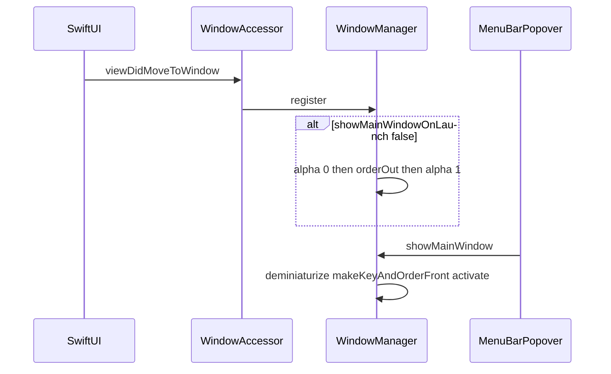

# Pencere yönetimi: WindowManager

Prompttaki teşhis doğru. Bugün ana pencere [`DeyeMacOS/App/DeyeMacOSApp.swift`](DeyeMacOS/App/DeyeMacOSApp.swift) içinde `window.close()` ile kapanıyor, [`MainDashboardView`](DeyeMacOS/Views/MainDashboardView.swift) `onAppear` aynı fonksiyonu tekrar çağırıyor, menü [`MenuBarPopoverView.openMainWindow()`](DeyeMacOS/Views/MenuBarPopoverView.swift) `openWindow` + başlık taraması yapıyor. Hedef: pencere yaşasın, X ve başlangıç sadece `orderOut` yapsın.

Promptu olduğu gibi uygulamak yetmez. Aşağıdaki sapmalar plana dahil.

## Promptta düzeltilen noktalar

- Yeni Swift dosyası [`DeyeMacOS.xcodeproj/project.pbxproj`](DeyeMacOS.xcodeproj/project.pbxproj) içine elle eklenmeli (`PBXBuildFile`, `PBXFileReference`, Services grubu, Sources). `make build` xcodebuild kullanıyor; dosya grupta yoksa derlenmez. `Package.swift` yolu otomatik tarar, asıl hedef Xcode.
- Proje Swift 5 (`SWIFT_VERSION = 5.0`), macOS 14. Sınıf `@MainActor`. `@unchecked Sendable` eklenmez; derleyici isterse o zaman bakılır.
- `applicationShouldTerminate` bayrak koyup `.terminateNow` döndürmeli. Dönüş yoksa imza eksik kalır ve X sırasındaki `windowShouldClose == false` çıkışı kilitleyebilir.
- `applicationShouldTerminateAfterLastWindowClosed` → `false`. Dock ikonu var (`Info.plist` içinde `LSUIElement` yok), bu yüzden `applicationShouldHandleReopen` gerçekten lazım.
- İlk kare titremesi: `viewDidMoveToWindow` çizimden önce değildir. Gizlenecekse önce `alphaValue = 0`, sonra `orderOut(nil)`, alfa hemen `1`e geri alınır ki sonraki açılış görünmez kalmasın.
- `window.delegate = self` SwiftUI delegesini ezer. Mevcut delegate varsa kapatma dışındaki çağrılar ona iletilir (`responds(to:)` / `forwardingTarget`).
- `windowDidMiniaturize` / `DidDeminiaturize` / `DidBecomeKey` için iş yok; boş metot yazılmaz. `toggleMainWindow()` yazılır, çağıran yok, menüye bağlanmaz.
- Menü hâlâ `@Environment(\.openWindow)` tutar. `mainWindow == nil` ise (accessor henüz çalışmadıysa) `openWindow(id: "main")`, sonra `showMainWindow()`.
- İstasyon değiştir: önce pencereyi göster, sonra `needsStationSelection = true`. Gizli pencerede sheet açılmasın.

## Yapılacaklar

1. [`DeyeMacOS/Services/WindowManager.swift`](DeyeMacOS/Services/WindowManager.swift) oluştur.
   - `shared`, `weak var mainWindow`, `weak var appState`, `isTerminating`, `hasAppliedStartupVisibility`.
   - `register`: delegate (proxy), `isReleasedWhenClosed = false`, bir kez başlangıç gizleme. Yalnızca `identifier == "main"` veya başlık `Deye Solar Monitor` olan pencere. Ayarlar sahnesi (`Settings { }`) bu view’da olmadığı için yakalanmaz.
   - `showMainWindow` / `hideMainWindow` / `toggleMainWindow` prompttaki gibi. Bulunamazsa `NSApp.windows` yedek taraması, sonra `NSApp.activate(ignoringOtherApps: true)`.
   - `windowShouldClose`: `isTerminating` ise `true`, değilse `orderOut` + `false`.

2. [`MainDashboardView.swift`](DeyeMacOS/Views/MainDashboardView.swift): `onAppear` içindeki `handleInitialWindowVisibility()` kalkar. Kök `Group`a `.background(WindowAccessor { ... register ... })`.

3. [`MenuBarPopoverView.swift`](DeyeMacOS/Views/MenuBarPopoverView.swift): `openMainWindow()` pencere taramasını bırakır. Üç çağrı yeri (satır 93, 177, 186) aynı helper’da kalır.

4. [`DeyeMacOSApp.swift`](DeyeMacOS/App/DeyeMacOSApp.swift): `handleInitialWindowVisibility` ve `hasHandledAppLaunch` silinir. `applicationDidFinishLaunching` boşalırsa metot da kalkar. Reopen → `showMainWindow()` + `true`. Terminate → `isTerminating = true` + `.terminateNow`. Son pencere kapanınca çıkma → `false`.

5. `project.pbxproj` Services grubuna dosyayı ekle.

6. `make build` ile derle. Görsel kontrol (flicker, kırmızı X, menüden anında açılış, Dock tıklaması, Çıkış’ın uygulamayı kapattığı) elle; bu ortamda pencere otomasyonu yok.

`showMainWindowOnLaunch` anahtarı ve UserDefaults anahtarı (`deye_show_main_window_on_launch`) [`AppState`](DeyeMacOS/App/AppState.swift) içinde duruyor; dokunulmaz. Varsayılan `false`.
